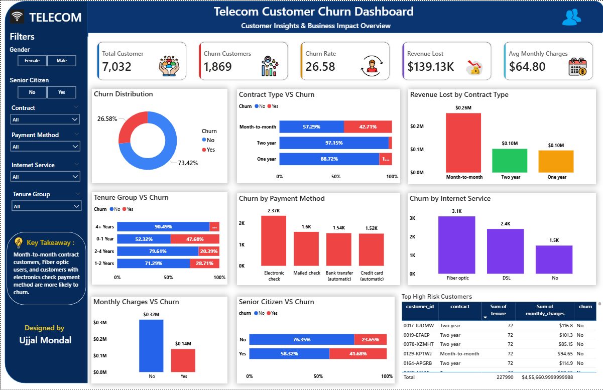

# Telecom Customer Churn Analysis & Prediction

## 📌 Project Overview

Customer churn is a major challenge for telecom companies because losing existing customers directly impacts revenue and customer lifetime value.

This project presents an end-to-end Telecom Customer Churn Analysis using Python, SQL, Power BI, and Machine Learning.

The objective was to identify the key factors influencing customer churn, quantify business impact, identify high-risk customer segments, and develop a predictive framework to support proactive customer retention.

---

## 🎯 Business Objectives

- Identify the key drivers of customer churn
- Analyze churn across customer segments
- Quantify the business impact of churn
- Identify high-risk customer profiles
- Build an interactive business intelligence dashboard
- Develop a machine learning model for churn prediction
- Provide actionable customer retention recommendations

---

## 🛠️ Tools & Technologies

| Area | Tools |
|---|---|
| Data Cleaning & EDA | Python, Pandas, NumPy |
| Data Visualization | Matplotlib, Seaborn |
| Database Analysis | PostgreSQL / SQL |
| Dashboarding | Microsoft Power BI |
| Machine Learning | Scikit-learn |
| Model | Logistic Regression |

---

## 🔄 Project Workflow

Raw Data  
↓  
Python Data Cleaning  
↓  
Exploratory Data Analysis  
↓  
SQL Business Analysis  
↓  
Power BI Dashboard  
↓  
Machine Learning Prediction  
↓  
Business Recommendations

---

## 📊 Key Business KPIs

| KPI | Value |
|---|---:|
| Total Customers | 7,032 |
| Churned Customers | 1,869 |
| Overall Churn Rate | 26.58% |
| Estimated Revenue Lost | $139.13K |
| Average Monthly Charges | $64.80 |

---

## 🔍 Key Business Insights

### 1. Contract Type

Month-to-month customers demonstrated the highest churn risk, while customers with longer-term contracts showed stronger retention.

**Business implication:** Customers without long-term commitment should be targeted with contract upgrade and loyalty programs.

---

### 2. Customer Tenure

Customers with shorter tenure showed higher churn behavior compared with long-tenure customers.

**Business implication:** The first months of the customer lifecycle represent a critical retention window.

---

### 3. Payment Method

Electronic check users represented a high-risk customer segment.

**Business implication:** The company should encourage automated payment methods through convenience benefits and incentives.

---

### 4. Internet Service

Fiber optic customers showed elevated churn behavior.

**Business implication:** Service quality, pricing, and customer satisfaction within this segment should be investigated.

---

### 5. Monthly Charges

Customers with higher monthly charges demonstrated increased churn risk.

**Business implication:** High-value customers should receive proactive engagement and personalized retention offers.

---

## 📈 Power BI Dashboard

The Power BI dashboard provides an interactive view of:

- Customer churn KPIs
- Contract-wise churn analysis
- Revenue loss analysis
- Tenure-based churn patterns
- Payment method analysis
- Internet service analysis
- High-risk customer segments



---

## 🤖 Machine Learning

### Problem Type

Binary Classification

### Target Variable

```text
Churn: Yes / No
